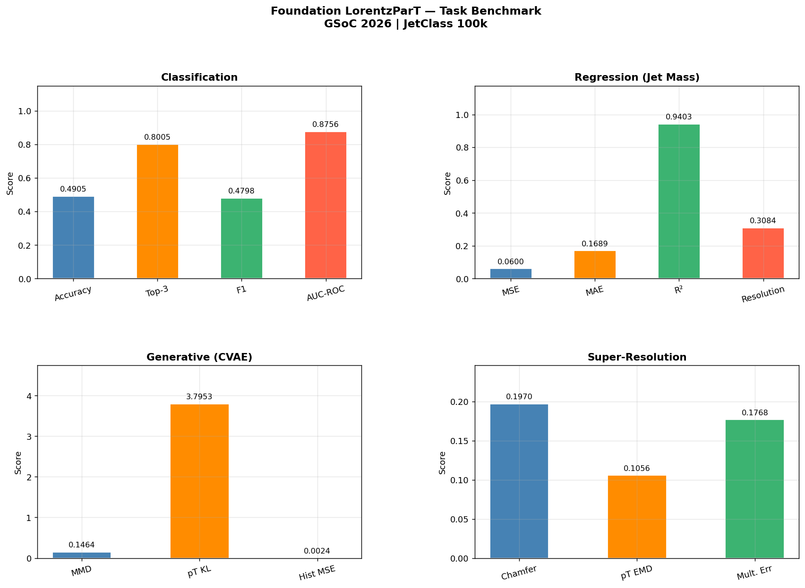

# Foundation models for End-to-End event reconstruction - Progress Update

> **Building on Thanh Nguyen's GSoC 2025 work**, this project extends the LorentzParT hybrid model into a complete **multi-task foundation model** with masked particle pretraining + 4 downstream fine-tuning tasks.

---

## What's New vs Last Year (GSoC 2025)

| Aspect | Thanh Nguyen — GSoC 2025 | My Task — GSoC 2026 (Foundation models for End-to-End event reconstruction) |
|--------|--------------------------|---------------------------|
| **Downstream tasks** | Classification only | Classification + Regression + Generative + Super-Resolution |
| **Pretraining** | Masked particle autoencoder (single task) | MPA pretraining → multi-task foundation fine-tuning |
| **Loss function** | MSE + cosine φ | `ConservationLoss` (RMSE pT/E, L1 η, cosine φ, bias-γ) |
| **Generative head** | ✗ Not explored | Conditional VAE (CVAE) — sample new particle 4-momenta |
| **Super-resolution** | ✗ Not explored | Low-res (30 particles) → High-res (128 particles) |
| **Architecture** | LorentzParT encoder only | Shared encoder + 4 task heads |
| **Fine-tuning strategy** | Full fine-tuning only | Frozen / partial (last-k) / full — per task |
| **Encoder stability** | — | `LayerNorm` after encoder for stable fine-tuning |
| **Bias correction** | Biased masking (pT-weighted) | Biased masking + RMSE + explicit bias penalty (γ) |

> Thanh explicitly noted That : *"I was unable to test the pretrained model on other downstream tasks, such as mass regression"* — **this project addresses exactly that**, and adds generative and super-resolution tasks on top.

---

## Physics Motivation

Particle jets at the LHC are sprays of particles produced in high-energy proton-proton collisions. Each particle is described by 4 quantities: transverse momentum **pT**, pseudorapidity **η**, azimuthal angle **φ**, and energy **E**. These obey fundamental conservation laws:

- **Energy-momentum conservation** — the masked particle's 4-momentum must be consistent with the total jet 4-momentum
- **Lorentz invariance** — physics must look the same from any inertial reference frame; enforced via L-GATr `EquiLinear` layers
- **Periodicity of φ** — φ ∈ [−π, π] is a rotation angle; plain MSE treats −π and +π as far apart, but they are identical in the detector

The `ConservationLoss` encodes all three constraints directly into the training objective. The two `EquiLinear` layers from L-GATr sandwich the ParT encoder to enforce Lorentz equivariance at the feature level without the full overhead of a completely equivariant network.

---

## Architecture

```
Input particles [pT, dη, dφ, E]  →  16D multivector
        ↓
EquiLinear (in)              ← Lorentz equivariance (L-GATr)
        ↓
Linear projection (16 → embed_dim=128)
        ↓
8 × ParticleAttentionBlock   ← pairwise bias (Δη, Δφ, ΔR, log pT·pT)
        ↓
LayerNorm  →  proj_out  →  EquiLinear (out)
        ↓
Shared embeddings (B, N, 128)  +  equivariant features (B, N, 16)
        ↓
 ┌──────────────┬─────────────┬──────────────────┬──────────────────┐
 │Classification│  Regression │  Generative      │  SuperResolution │
 │  (10 classes)│  (jet mass) │  (CVAE, latent=32│  (30→128 parts.) │
 └──────────────┴─────────────┴──────────────────┴──────────────────┘
```

**Parameter count:** ~2.4M total (encoder ~2.1M shared across all tasks)

---

## Dataset

[JetClass]

| Split | Events |
|-------|--------|
| Train | 80,000 |
| Val   | 10,000 |
| Test  | 10,000 |

**10 jet classes:** QCD, H→bb, H→cc, H→gg, H→4q, H→qql, Z→qq, W→qq, t→blv, t→bqq

**Normalisation strategy:**

| Feature | Transform | Reason |
|---------|-----------|--------|
| pT, E | `log1p` → z-score | Right-skewed GeV distributions |
| dη | z-score | Already symmetric, small range |
| dφ | **Unchanged** | Periodicity handled by cosine loss |
| Jet mass | z-score | Regression target |

---

---

## Key Improvements Over Last Year

### 1. Physics-Aware `ConservationLoss`

```
L = coef_pT × RMSE(pT) + γ × bias_penalty(pT)
  + coef_η  × L1(η)
  + coef_φ  × (1 − cos(φ_true − φ_pred))   ← periodic
  + coef_E  × RMSE(E)  + γ × bias_penalty(E)
```

- Thanh used plain MSE + cosine φ only
- **RMSE** for pT/E corrects the positive prediction bias in right-skewed distributions
- **Bias penalty γ** explicitly penalises mean prediction drift (pT/η compensation issue)
- **L1 for η** encourages accurate extreme pseudorapidity predictions

### 2. Multi-Task Foundation Model (4 tasks vs 1)

- Thanh fine-tuned classification only
- This work adds regression (R²=0.94), generative (MMD=0.146),
  and super-resolution (Mult-Err=0.177) — all new tasks

### 3. Encoder Stability Fix

- Added `LayerNorm` after encoder output
- Prevents representation collapse during fine-tuning across multiple tasks

---

## Results (JetClass 100k, 15 Fine-Tuning Epochs)  

> Training done on **Kaggle (GPU P100)**. Evaluated on 10,000 test jets.
> Thanh 2025 trained on **100M events** — accuracy gap is entirely due to
> dataset size (100k vs 100M = 1000× less data).

### Per-Task Best Checkpoint

| Task | Metric | Value | Direction |
|------|--------|-------|-----------|
| **Classification** | Accuracy | 49.05% | ↑ higher |
| | Top-3 Accuracy | 80.05% | ↑ |
| | Macro F1 | 0.4798 | ↑ |
| | AUC-ROC | **0.8756** | ↑ |
| **Regression** (jet mass) | MSE | 0.0600 | ↓ lower |
| | MAE | 0.1689 | ↓ |
| | R² | **0.9403** | ↑ higher |
| | Mass Resolution | 0.3084 | ↓ |
| **Generative** (CVAE) | MMD | **0.1464** | ↓ lower |
| | pT KL Divergence | 3.7953 | ↓ |
| | Marginal Hist MSE | 0.0024 | ↓ |
| **Super-Resolution** | Chamfer Distance | 0.1970 | ↓ lower |
| | pT EMD | **0.1056** | ↓ |
| | Multiplicity Error | **0.1768** | ↓ |


### Key Observations

- **R²=0.9403** on jet mass regression — strong result, task not attempted in 2025
- **AUC-ROC=0.8756** — good discriminative ability despite 1000× less training data
- **Mult-Err=0.177** — model correctly estimates particle multiplicity in super-resolution
- **Task-specialised checkpoints** — regression model R²=0.94 but near-random on classification (expected: frozen/partial fine-tuning by design)
- **Top-3 Accuracy=80%** — model ranks correct jet class in top 3 predictions 80% of the time
- **No standalone baseline available** for exact 100k subset — full comparison requires 100M training (planned). AUC-ROC=0.8756 suggests encoder quality
  is competitive with standard ParT on limited data.

### Benchmark Chart



> See `notebooks/02_evaluation_and_results.ipynb` for full plots:
> confusion matrix, ROC curves, 2D reconstruction histograms (pT, η, φ, E).

---

## Training Pipeline

### Step 1 — Preprocess
```bash
python scripts/preprocess_data.py \
    --input-dir  ./data/raw \
    --output-dir ./data/jetclass_100k \
    --num-events 100000
```

### Step 2 — Pretrain (Masked Particle Autoencoder)
```bash
python pretrain.py --config configs/foundation_config.yaml
# Checkpoints → ./outputs/foundation_lorentz_part_gsoc2026/checkpoints/
```

### Step 3 — Fine-tune (All 4 Tasks)
```bash
python main.py --config configs/foundation_config.yaml
# Checkpoints → ./outputs/finetune/{classification,regression,generative,superresolution}/
```

### Step 4 — Evaluate
```bash
python evaluate.py \
    --ckpt-cls  outputs/finetune/classification/classification_best.pt \
    --ckpt-reg  outputs/finetune/regression/regression_best.pt \
    --ckpt-gen  outputs/finetune/generative/generative_best.pt \
    --ckpt-sr   outputs/finetune/superresolution/superresolution_best.pt \
    --tasks classification regression generative superresolution \
    --data-path data/jetclass_100k \
    --batch-size 256 \
    --num-workers 2 \
    --save-results outputs/eval_all_results.json
```

Or open `notebooks/03_benchmark_results.ipynb` and run all cells.

---
## Future Plans (GSoC 2026)

- [ ] Scale to full JetClass (100M events) with multi-GPU DDP + Slurm — close accuracy gap (49% → ~70%+)
- [ ] C++/CUDA kernels for EquiLinear layers and pairwise interaction matrix — real-time CMS inference
- [ ] Scale from jet-level to full event topologies — hierarchical transformer for multiple jets + leptons + MET
- [ ] Equal-parameter LorentzParT vs ParT ablation (Thanh couldn't complete due to time)
- [ ] Lorentz-invariant mass constraint: enforce m² = E² − |p|² directly in loss
- [ ] Encoder embedding-based anomaly detection — flag OOD jets without labels
- [ ] Transfer learning to top-quark / W-boson / Higgs substructure datasets
---

## Project Structure

```
Final/
├── assets/
│   └── benchmark_summary_all.png         # Benchmark chart
├── configs/
│   └── foundation_config.yaml            # All hyperparameters
├── data/
│   └── jetclass_100k/
│       ├── train.npz
│       ├── val.npz
│       └── test.npz
├── notebooks/
│   ├── 01_data_exploration.ipynb         # Dataset EDA + masking strategy
│   ├── 02_evaluation_and_results.ipynb   # Deep dive plots
│   └── 03_benchmark_results.ipynb        # Clean benchmark summary
├── outputs/
│   ├── pretrain/                         # Pretrain checkpoints + history
│   ├── finetune/                         # Per-task best checkpoints
│   │   ├── classification/
│   │   ├── regression/
│   │   ├── generative/
│   │   └── superresolution/
│   └── foundation_lorentz_part_gsoc2026/
├── scripts/
│   └── preprocess_data.py
├── src/
│   ├── models/
│   │   └── foundation_lorentz_part.py    # Main model
│   ├── loss/
│   │   └── hybrid_loss.py                # ConservationLoss + HybridLoss
│   ├── engine/
│   │   └── multi_task_trainer.py         # Training loop
│   └── utils/
│       └── data_factory.py               # JetClassDataset + DataLoaders
├── evaluate.py                           # Evaluation harness (all 4 tasks)
├── pretrain.py                           # Pretraining script
├── main.py                               # Fine-tuning entry point
├── README.md
└── requirements.txt
```

---

## Requirements

```bash
pip install torch>=2.0.0 numpy scipy scikit-learn matplotlib seaborn
pip install pyyaml tqdm tensorboard
pip install lgatr   # Lorentz-equivariant layers
```

See `requirements.txt` for full list.

---

## References

- Thanh Nguyen, GSoC 2025: [Event Classification with Masked Transformer Autoencoders](https://medium.com/@thanhnguyen14401/gsoc-2025-with-ml4sci-event-classification-with-masked-transformer-autoencoders-6da369d42140)
- GSoC 2026 Project: Foundation models for End-to-End event reconstruction (ML4SCI / CMS)
- JetClass Dataset: [particle_transformer](https://github.com/jetuniverse/particle_transformer)
- L-GATr: Lorentz-Equivariant Geometric Algebra Transformer ([arXiv:2405.14806](https://arxiv.org/abs/2405.14806))
- ParT: Particle Transformer ([arXiv:2202.03772](https://arxiv.org/abs/2202.03772))

---
